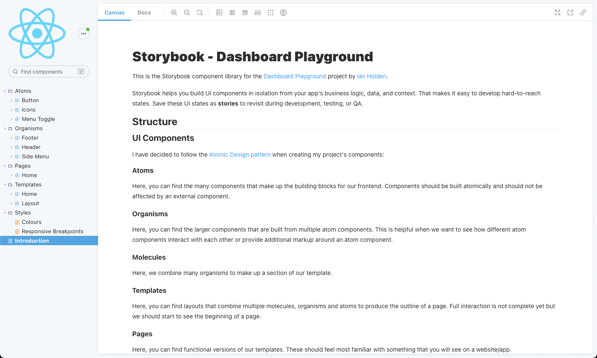

# Dashboard Playground

I have built this project to give myself an opportunity to  build a component library using the tech stack described below.

## Tech Stack

| Technology            | Notes |
| --------------------- | --------------------- |
| CSS                   | Simple styles. |
| Cypress               | Integration testing. |
| ESLint                | Linting template to enforce consistent code style. |
| HTML                  | Modern, semantically descriptive markup. |
| Jest                  | Unit testing for my components. |
| React                 | This project was bootstrapped with [Create React App](https://github.com/facebook/create-react-app). |
| React Testing Library | Test utilities to test what the user sees and not the implementation details. |
| TypeScript            | Enforcing strict type checking. |
| Storybook             | Component library documentation. |

## Getting Started

1. Clone this repository and navigate to this directory in your command line interface.
1. Install dependencies: `npm install`
1. Start project locally: `npm start`
1. Open the project in your browser: http://localhost:3000/

## Available Scripts

In the project directory, you can run:

### `npm start`

Runs the app in the development mode.\
Open [http://localhost:3000](http://localhost:3000) to view it in the browser.

The page will reload if you make edits.\
You will also see any lint errors in the console.

### `npm test`

Launches the test runner in the interactive watch mode.

### `npm run build`

Builds the app for production to the `build` folder.\
It correctly bundles React in production mode and optimizes the build for the best performance.

The build is minified and the filenames include the hashes.\
Your app is ready to be deployed!

See the section about [deployment](https://facebook.github.io/create-react-app/docs/deployment) for more information.

### `npm run storybook`

Start Storybook locally.\
Once started, you can access the Storybook UI at http://localhost:6006/.

### `npm run build-storybook`

Build and output Storybook as a static web application.\
The static application is built to a new directory here: `/storybook-static`.

## Storybook

I have used Storybook to help build my component library. Storybook gives you a unique set of tools and utilities to make developing and testing components much easier.

### Accessibility

I have used the [Accessibility addon for Storybook](https://storybook.js.org/addons/@storybook/addon-a11y) to help identify accessibility issues in our components markup or design.

## Screenshots

### Dashboard Playground UI

### Storybook - Component Library
